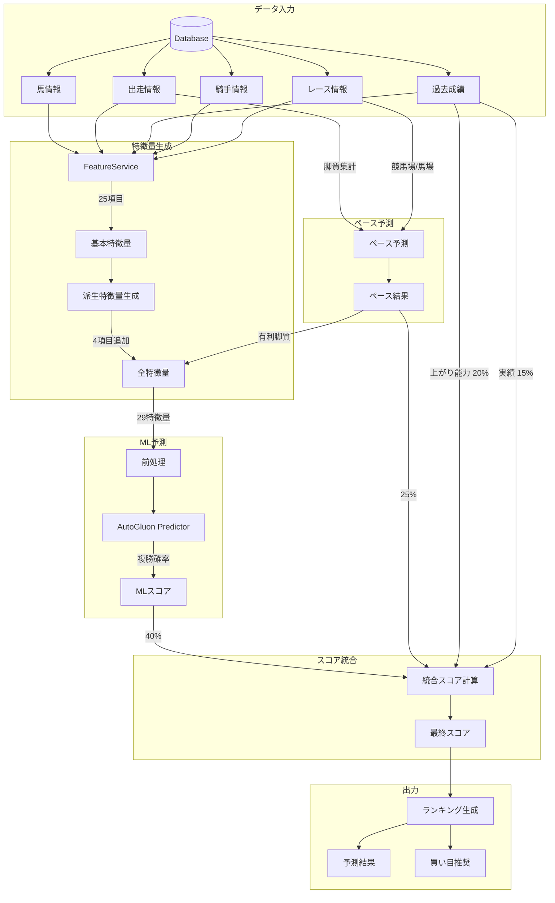

# Boonta Backend - AI予測システム ドキュメント

## 概要

Boontaは日本のG1競馬レースの予測AIサービスです。AutoGluonを使用した機械学習モデルで、過去の成績データ、脚質、騎手統計、追い切り情報などから複勝（3着以内）を予測します。

### モデル性能

| 指標 | 値 |
|-----|-----|
| フレームワーク | AutoGluon TabularPredictor |
| 問題タイプ | 二値分類（複勝予測） |
| 評価指標 | ROC-AUC |
| 現在の性能 | **0.801** |

### 特徴量重要度 TOP 10

| 順位 | 特徴量 | 重要度 | 説明 |
|-----|-------|--------|------|
| 1 | 上がり3F (last_3f) | 0.0278 | 末脚速度 - 最重要指標 |
| 2 | 対数オッズ (log_odds) | 0.0225 | オッズの対数変換 |
| 3 | オッズ (odds) | 0.0177 | 市場評価 |
| 4 | 脚質 (running_style) | 0.0140 | ペース適性 |
| 5 | 人気 (popularity) | 0.0117 | 市場人気度 |
| 6 | 馬番 (horse_number) | 0.0103 | 枠番との関連 |
| 7 | 斤量 (weight) | 0.0066 | 負担重量 |
| 8 | 馬体重 (horse_weight) | 0.0062 | 馬の体格 |
| 9 | グレード (grade) | 0.0053 | レースレベル |
| 10 | 芝/ダート (course_type) | 0.0047 | コース種別 |

> 上位3特徴量（last_3f, log_odds, odds）で全予測力の約70%を占める

---

## 特徴量詳細

### 基本特徴量（25項目）

#### 馬の基本情報（4項目）

| 特徴量 | 説明 | デフォルト値 | データソース |
|-------|------|------------|-------------|
| horse_age | 馬の年齢 | 4 | Horse.age |
| horse_sex | 性別（牡/牝/セ） | "Unknown" | Horse.sex |
| horse_weight | 馬体重（kg） | 480 | RaceEntry.horse_weight |
| horse_weight_diff | 前回比体重変化（kg） | 0 | RaceEntry.horse_weight_diff |

#### レース条件（9項目）

| 特徴量 | 説明 | デフォルト値 | データソース |
|-------|------|------------|-------------|
| distance | レース距離（m） | 2000 | Race.distance |
| course_type | 芝/ダート | - | Race.course_type |
| venue | 競馬場 | - | Race.venue |
| track_condition | 馬場状態（良/稍重/重/不良） | - | Race.track_condition |
| weather | 天候 | - | Race.weather |
| post_position | 枠番（1-8） | 5 | RaceEntry.post_position |
| horse_number | 馬番（1-18） | 5 | RaceEntry.horse_number |
| weight | 斤量（kg） | 55 | RaceEntry.weight |
| grade | レースグレード | - | Race.grade |

#### オッズ・人気（2項目）

| 特徴量 | 説明 | デフォルト値 | データソース |
|-------|------|------------|-------------|
| odds | 単勝オッズ | 10.0 | RaceEntry.odds |
| popularity | 人気順（1=最人気） | 8 | RaceEntry.popularity |

#### 脚質・展開（3項目）

| 特徴量 | 説明 | デフォルト値 | データソース |
|-------|------|------------|-------------|
| running_style | 脚質（ESCAPE/FRONT/STALKER/CLOSER/VERSATILE） | "Unknown" | RaceEntry.running_style |
| escape_horse_count | 出走馬中の逃げ馬数 | 1 | 計算値 |
| front_horse_count | 出走馬中の先行馬数 | 4 | 計算値 |

#### 過去成績（6項目）

| 特徴量 | 説明 | デフォルト値 | 計算方法 |
|-------|------|------------|---------|
| avg_position_last5 | 過去5走の平均着順 | 5.0 | 直近5走の着順平均 |
| win_rate | 勝率 | 0.1 | 1着回数 / 総出走数 |
| place_rate | 複勝率 | 0.3 | 3着以内回数 / 総出走数 |
| avg_last_3f | 平均上がり3F（秒） | 35.0 | 過去走の上がり3F平均 |
| best_last_3f | ベスト上がり3F（秒） | 34.0 | 過去走の上がり3F最小値 |
| days_since_last_race | 前走からの日数 | - | レース日 - 前走日 |

#### 騎手情報（2項目）

| 特徴量 | 説明 | デフォルト値 | データソース |
|-------|------|------------|-------------|
| jockey_win_rate | 騎手の勝率 | 0.1 | Jockey.win_rate |
| jockey_venue_win_rate | 騎手の競馬場別勝率 | 0.1 | Jockey.venue_win_rate |

#### 追い切り（1項目）

| 特徴量 | 説明 | デフォルト値 | データソース |
|-------|------|------------|-------------|
| workout_evaluation | 追い切り評価（A/B/C/D） | - | RaceEntry.workout_evaluation |

### 派生特徴量（4項目）

基本特徴量から自動計算される特徴量です。

| 特徴量 | 計算式 | 目的 |
|-------|-------|------|
| log_odds | log(odds) | オッズの非線形な予測力をキャプチャ |
| weight_ratio | weight / horse_weight | 馬にとっての相対的負荷 |
| form_score | (1 / avg_position_last5) × win_rate | 馬の調子の総合指標 |
| pace_advantage | 脚質とペース環境の適合度（後述） | 1.2（有利）〜0.85（不利） |

---

## ペース予測ロジック

展開予測は、脚質の分布から予想されるペースを判定し、各馬の有利不利を評価します。

### 脚質の定義

| 脚質 | 日本語 | 説明 |
|-----|-------|------|
| ESCAPE | 逃げ | 先頭から逃げる走法 |
| FRONT | 先行 | 先行集団に位置する走法 |
| STALKER | 差し | 中団から差す走法 |
| CLOSER | 追込 | 後方から追い込む走法 |
| VERSATILE | 自在 | 状況に応じて対応可能 |

### ペース判定ルール

| 逃げ馬数 | 先行馬数 | ペース | 信頼度 | 有利な脚質 |
|---------|---------|-------|-------|-----------|
| 3頭以上 | - | ハイ | 85% | 差し、追込 |
| 2頭 | - | ハイ | 70% | 差し、追込 |
| 0頭 | - | スロー | 80% | 先行、差し |
| 1頭 | 2頭以下 | スロー | 75% | 逃げ、先行 |
| 1頭 | 5頭以上 | ミドル | 60% | 先行、差し |
| その他 | - | ミドル | 50% | 先行、差し |

### 競馬場特性

各競馬場の物理的特性がペース有利度に影響します。

| 競馬場 | 前有利度 | 形状 | 直線距離 | 特徴 |
|-------|---------|------|---------|------|
| 小倉 | +0.20 | 小回り | 293m | 平坦小回り、前残り |
| 函館 | +0.20 | 小回り | 262m | 洋芝最小回り、前残り |
| 中山 | +0.15 | 小回り | 310m | 急坂小回り、前有利 |
| 札幌 | +0.15 | 小回り | 266m | 洋芝小回り、前有利 |
| 福島 | +0.15 | 小回り | 292m | 小回り、前有利 |
| 中京 | +0.05 | 中程度 | 412m | 坂あり、やや前有利 |
| 阪神 | 0.00 | 中程度 | 473m | バランス型 |
| 京都 | -0.05 | 大回り | 404m | 平坦、末脚勝負 |
| 東京 | -0.10 | 大回り | 525m | 長い直線、差し有利 |
| 新潟 | -0.15 | 大回り | 659m | 超長い直線、追込有利 |

### 馬場状態の影響

| 馬場状態 | 前有利修正 | 説明 |
|---------|----------|------|
| 良 | +0.00 | 標準（ベースライン） |
| 稍重 | +0.05 | やや時計かかる、やや前有利 |
| 重 | +0.10 | パワー必要、前残り傾向 |
| 不良 | +0.15 | 消耗戦、先行有利 |

### ペース有利度スコア

脚質ごとにペース環境への適合度をスコア化（基準値: 1.0）

| 状況 | 有利脚質 | スコア | 不利脚質 | スコア |
|-----|---------|-------|---------|-------|
| ハイペース | 差し | 1.20 | 逃げ | 0.85 |
| ハイペース | 追込 | 1.15 | 先行 | 0.85 |
| スローペース | 逃げ | 1.20 | 差し | 0.85 |
| スローペース | 先行 | 1.15 | 追込 | 0.85 |

---

## 予測データフロー



---

## モデル設定

### AutoGluon設定

| パラメータ | 値 | 説明 |
|-----------|-----|------|
| problem_type | binary | 二値分類 |
| eval_metric | roc_auc | ROC曲線下面積 |
| time_limit | 3600秒 | 最大訓練時間 |
| presets | best_quality | 最高精度優先 |

### モデルファイル

```
backend/models/place_predictor/
├── predictor.pkl       # 予測器本体
├── learner.pkl         # 学習器
├── metadata.json       # メタデータ
└── models/             # アンサンブルモデル
```

### スコア統合の重み付け

**MLモデル使用時:**

| コンポーネント | 重み | 説明 |
|--------------|------|------|
| MLスコア | 40% | AutoGluon予測 |
| ペース適性 | 25% | 展開予測との適合 |
| 上がり能力 | 20% | best_last_3fに基づく |
| 実績 | 15% | win_rate, place_rate |

**フォールバック時（MLモデルなし）:**

| コンポーネント | 重み | 説明 |
|--------------|------|------|
| オッズスコア | 20% | 1/odds正規化 |
| ペース適性 | 35% | 展開予測を重視 |
| 上がり能力 | 25% | 末脚重視 |
| 実績 | 20% | 過去成績 |

### フォールバック予測ロジック

MLモデルが未学習の場合、オッズベースの簡易予測を使用:

- **着順予測**: オッズの逆ランク（低オッズ = 良い予測位置）
- **複勝確率**: `(1/odds) / Σ(1/odds) × 3` で正規化

---

## 関連ファイル

| ファイル | 説明 |
|---------|------|
| app/ml/features.py | 特徴量エンジニアリング |
| app/ml/pace.py | ペース予測ロジック |
| app/ml/trainer.py | モデル訓練 |
| app/ml/predictor.py | モデル予測 |
| app/services/feature_service.py | 特徴量構築サービス |
| app/services/prediction_service.py | 予測サービス統合 |
| app/api/model.py | モデルAPI |
